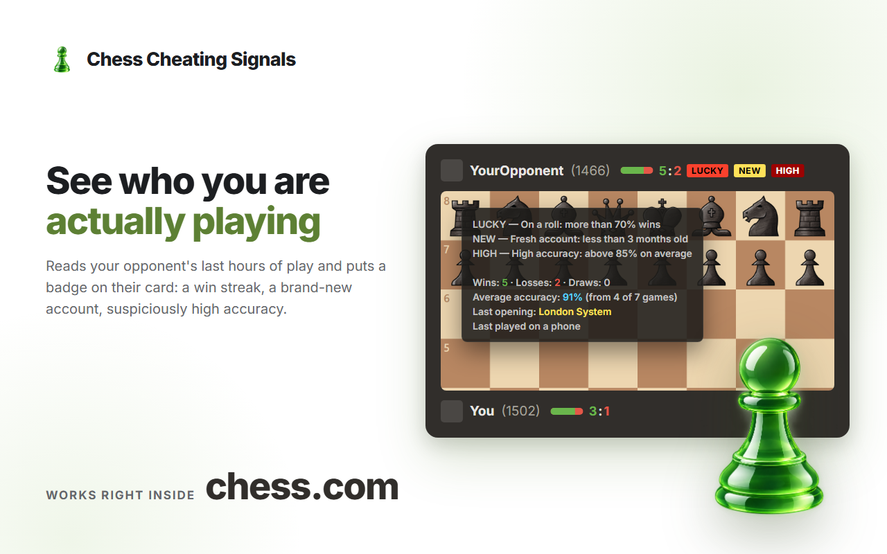

# Chess Cheating Signals

**See who you are actually playing — before your first move.**

A free Chrome extension (Manifest V3) that reads your opponent's finished games from the last few
hours and puts a small badge right on their card on chess.com. No sign-up, no account, no paid
tier, no server of its own.

[](https://chromewebstore.google.com/detail/fnpboablfdjolmlogkmochacdlpeeacc)
[](LICENSE)


**[Website](https://chess.fbextractor.com)** ·
[Privacy Policy](https://chess.fbextractor.com/privacy.html) ·
[Chrome Web Store](https://chromewebstore.google.com/detail/fnpboablfdjolmlogkmochacdlpeeacc)



## The signals

Four badges, each shown only when its condition holds within the analysis window:

| Badge | Meaning | Default condition |
| --- | --- | --- |
| `LUCKY` | On a roll | win rate above 70%, more than 5 games |
| `NEW` | Fresh account | registered less than 3 months ago |
| `HIGH` | High accuracy | above 85% on average, at least 3 reviewed games |
| `COLD` | Cold streak | win rate below 30%, more than 5 games |

Next to the badges, a win/loss bar with the score sums up the same window. It is shown on your own
card by default and can be switched on for your opponent as well.

Hovering the card opens the details: wins, losses and draws, average accuracy and how many games it
was measured from, the last opening played, and whether the last game came from a phone or a PC.

## Settings

Everything is adjustable from the popup, and one button restores the defaults:

| Setting | Default |
| --- | --- |
| Analysis window | 12 hours |
| Modes counted | bullet, blitz, rapid |
| `LUCKY` / `COLD` win rate thresholds | 70% / 30% |
| `HIGH` accuracy threshold | 85% |
| `NEW` account age | 3 months |
| Minimum games / minimum reviewed games | 5 / 3 |
| Win/loss indicator | on your card only |

Settings live in `chrome.storage.sync`, so they follow your Chrome profile.

## Install

**[Install from the Chrome Web Store](https://chromewebstore.google.com/detail/fnpboablfdjolmlogkmochacdlpeeacc)**
— the listing is still under review, so the link starts working once it is approved.

Loading this repository as an unpacked extension will **not** work. The chess.com API client
(`src/content/api.js`) is not part of the public source tree, and `manifest.json` still lists it,
so Chrome will refuse to load the folder. Everything else — the analysis, the interface, all 55
dictionaries — is here and is exactly what ships in the store build.

## Privacy

The extension has no backend. It reads only the public game history that chess.com already shows,
straight from your browser, and it stores nothing but your settings and a 60-second in-memory cache
of the last responses.

No analytics, no accounts, no telemetry, nothing leaves your machine. The manifest asks for two
things only: `storage` and access to `chess.com`.

Full policy: [Privacy Policy](https://chess.fbextractor.com/privacy.html).

## What this is not

This is not cheat detection. It runs no engine, suggests no moves, and automates nothing. It cannot
tell you whether someone is cheating — it only shows what their recent games look like. The
conclusions are yours to draw.

## Project layout

```
manifest.json
icons/                  extension icons
fonts/                  Inter (variable, latin + cyrillic), OFL 1.1
svg/                    badge and indicator graphics
src/
  i18n.js               translation loader, shared by the page and the popup
  tokens.css            design tokens
  content/
    settings.js         defaults + chrome.storage.sync
    locale.js           detects the chess.com interface language
    analyze.js          win/loss/draw, accuracy and badge logic
    ui.js               renders badges into the player row
    index.js            page observation and orchestration
    badges.css
  popup/                settings popup
i18n/<code>.json        55 flat dictionaries, one per language
_locales/<code>/        store name and description for the 42 locales Chrome accepts
tools/build-locales.mjs regenerates _locales
docs/                   landing page and privacy policy (GitHub Pages)
```

## Languages

All 55 chess.com interface languages are supported, and the language is picked up in two different
places:

| Where | Which language | Source |
| --- | --- | --- |
| badges and tooltip on the page | the chess.com interface language | `src/content/locale.js` |
| settings popup | the browser language | `chrome.i18n.getUILanguage()` |

`chrome.i18n` alone will not do for on-page text: it is tied to the browser language and cannot be
pointed at the language of the site, so the loader is our own (`src/i18n.js`) and the dictionaries
are flat `{ "key": "string with $1" }` files in `i18n/`. A missing key falls back to English.

Right-to-left scripts (`ar`, `fa`, `he`, `ur`) are handled with a `dir` attribute on the tooltip and
the popup, with logical CSS properties throughout.

To fix or improve a translation:

1. edit `i18n/<code>.json` — the keys are the ones in [`i18n/en.json`](i18n/en.json);
2. run `node tools/build-locales.mjs` to regenerate `_locales` (Node 18+) — it copies the store
   name and description into the 42 locales Chrome supports; the remaining languages show the
   English store card but a fully translated interface;
3. open a pull request.

Keep the keys and the placeholders (`$1`, `$2`, `$3`) exactly as they are in English — only the
text around them should change.

## License

Code is released under the MIT License — see [LICENSE](LICENSE).
The Inter font is distributed under the SIL Open Font License 1.1 and is not covered by MIT.

## Disclaimer

Not affiliated with, endorsed by, or connected to Chess.com. All trademarks belong to their
respective owners.

